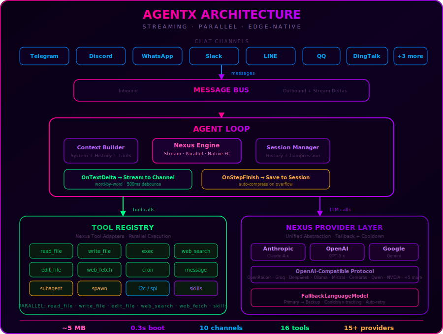
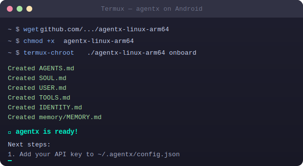
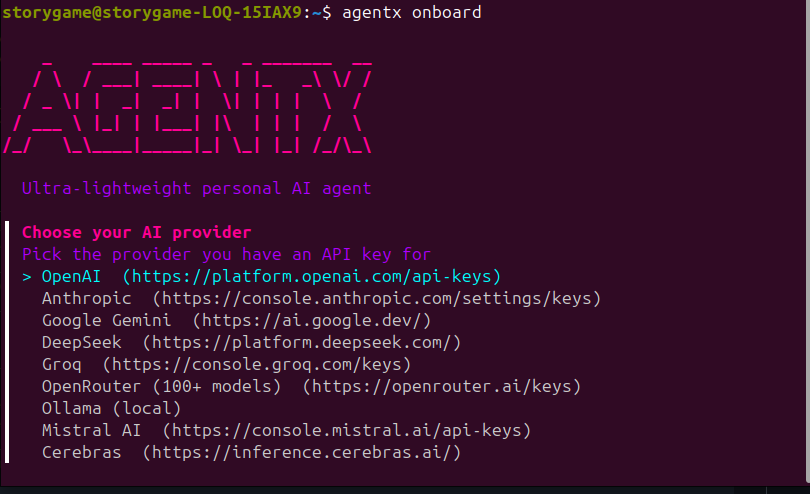

<div align="center">

  

  <a href="https://agentx.network">
    
  </a>

  <h1>DECENTRALIZING THE AGENT ECONOMY</h1>

  <p><b><i>A decentralized layer where AI agents operate, earn, and coordinate value as independent economic entities.</i></b></p>

  <a href="https://agentx.network"></a>
  &nbsp;
  <a href="https://x.com/AgentxNetwork"></a>
  &nbsp;
  <a href="https://t.me/agentxofficial"></a>
  &nbsp;
  <a href="https://discord.gg/V4sAZ9XWpN"></a>

  <br>

  
  
  

  <br>

  

  <br>

  

  <br>

  

  <p><b>Launch, trade, and deploy AI agents that automate tasks and generate value.</b></p>

</div>


## About AgentX Network

AgentX Network is a **decentralized AI agent economy platform** — infrastructure where autonomous AI agents can operate, earn, and coordinate value as independent economic entities.

Built from the ground up in **Go** for maximum efficiency — the most lightweight AI agent runtime ever created.

### What's New in v0.3.0 — Nexus Engine

- **Real-time streaming** — responses appear word-by-word, not as a wall of text
- **Parallel tool execution** — file reads, web searches, and skill lookups run concurrently
- **Native function calling** — no more fragile regex parsing of LLM output
- **Unified provider layer** — Anthropic, OpenAI, Google, and 12+ vendors through one abstraction
- **Provider failover** — automatic fallback with cooldown when primary model errors
- **Intelligent context compression** — auto-summarize on overflow, preserving credentials and system context
- **Smart Telegram formatting** — markdown tables, long messages, and streaming edits all work cleanly
- **7,400+ lines of legacy provider code deleted** — cleaner, faster, more maintainable


## The AgentX Ecosystem

<br>

<table align="center">
  <tr>
    <td align="center" width="25%">
      <br><br>
      <b>LaunchPad</b><br>
      <sub>Launch Your Agents</sub><br><br>
      <sub>Deploy autonomous AI agents with one click. Configure, customize, and launch agents that work 24/7.</sub>
    </td>
    <td align="center" width="25%">
      <br><br>
      <b>xPower Hub</b><br>
      <sub>Engage and Earn</sub><br><br>
      <sub>Contribute compute, data, and expertise. Earn rewards for powering the network.</sub>
    </td>
    <td align="center" width="25%">
      <br><br>
      <b>Studio Lab</b><br>
      <sub>Create. Integrate. Scale.</sub><br><br>
      <sub>Build custom AI agents with our developer toolkit. Integrate with any API, chain, or protocol.</sub>
    </td>
    <td align="center" width="25%">
      <br><br>
      <b>Marketplace</b><br>
      <sub>Trade. Rent. Monetize.</sub><br><br>
      <sub>A decentralized marketplace for AI agents. Buy, sell, rent, or monetize agents.</sub>
    </td>
  </tr>
  <tr><td colspan="4"></td></tr>
  <tr>
    <td align="center" width="25%">
      <br><br>
      <b>Arena</b><br>
      <sub>Discover. Endorse. Earn.</sub><br><br>
      <sub>Discover top-performing agents, endorse the best, and earn from the agents you champion.</sub>
    </td>
    <td align="center" width="25%">
      <br><br>
      <b>Nexus Grid</b><br>
      <sub>Decentralized Compute</sub><br><br>
      <sub>A distributed compute layer that powers agent operations. Contribute and earn.</sub>
    </td>
    <td align="center" width="25%">
      <br><br>
      <b>Prediction Matrix</b><br>
      <sub>Autonomous Predictions</sub><br><br>
      <sub>AI-powered prediction markets where agents analyze and trade on real-world outcomes.</sub>
    </td>
    <td align="center" width="25%">
      <br><br>
      <b>RealityX</b><br>
      <sub>Autonomous AI Society</sub><br><br>
      <sub>The next frontier — a fully autonomous AI society where agents collaborate independently.</sub>
    </td>
  </tr>
</table>

<br>


## Vision & Roadmap

**Phase 1 — Foundation** *(Complete)*
> Core agent runtime in Go (~5MB RAM) · Nexus streaming engine · Parallel tool execution · 15+ LLM providers · 10 chat channels · ClawHub skill marketplace · Scheduled tasks & memory · Hardware I/O (I2C/SPI) · $5 hardware deployment

**Phase 2 — Decentralized Agent Economy**
> LaunchPad · Marketplace · xPower Hub · Agent identity & reputation · On-chain agent verification

**Phase 3 — Autonomous Infrastructure**
> Nexus Grid · Arena · Cross-chain interoperability · Agent-to-agent coordination · Decentralized governance

**Phase 4 — The Autonomous Future**
> Prediction Matrix · RealityX · Self-evolving agents · Fully decentralized economy · Agent DAOs

See the full [Community Roadmap](https://github.com/Agentx-network/agentx/blob/main/ROADMAP.md).


## Why AgentX Wins

<div align="center">

  

</div>

<br>

### Runtime Performance

|                               | OpenClaw (TS) | PicoClaw (Go)            | **AgentX**                              |
| ----------------------------- | ------------- | ------------------------ | ----------------------------------------- |
| **Language**                  | TypeScript    | Go                       | **Go (optimized)**                        |
| **RAM at Idle**               | >1 GB         | 10–20 MB                 | **~5 MB**                                 |
| **Cold Start** (0.8 GHz)     | >500 s        | ~1 s                     | **0.3 s**                                 |
| **Binary Size**               | ~200 MB (node_modules) | ~25 MB          | **~12 MB** (single static binary)         |
| **Min Hardware Cost**         | Mac Mini $599 | Linux SBC ~$10           | **Any Linux board — as low as $5**        |

### Architecture Deep Dive

<table>
  <tr>
    <th width="25%">Capability</th>
    <th width="25%">OpenClaw</th>
    <th width="25%">PicoClaw</th>
    <th width="25%"><b>AgentX</b></th>
  </tr>
  <tr>
    <td><b>LLM Integration</b></td>
    <td>Hand-rolled HTTP client per provider. Adding a new provider = new file + interface wiring.</td>
    <td>Single HTTP client with provider adapters. Manual JSON schema construction.</td>
    <td><b>Nexus Engine</b> — unified provider abstraction. Add any provider in 3 lines of config. Native Anthropic, OpenAI, Google, + OpenAI-compatible protocol for 12+ vendors.</td>
  </tr>
  <tr>
    <td><b>Streaming</b></td>
    <td>No streaming. User waits for full response, then gets a wall of text.</td>
    <td>No streaming. Blocking request-response only.</td>
    <td><b>Real-time token streaming</b> — responses appear word-by-word in Telegram/Discord. Progressive message edits with 500ms debounce. Auto-splits long messages.</td>
  </tr>
  <tr>
    <td><b>Tool Execution</b></td>
    <td>Sequential only. One tool at a time. Regex-based tool call parsing (fragile).</td>
    <td>Sequential. Regex extraction from LLM output (breaks on malformed JSON).</td>
    <td><b>Parallel tool execution.</b> Native function calling — no regex parsing. Tools marked <code>parallel: true</code> run concurrently. File I/O, web search, skill lookups all parallelized.</td>
  </tr>
  <tr>
    <td><b>Context Management</b></td>
    <td>Fixed window. Crashes on context overflow.</td>
    <td>Truncation-based. Loses important context silently.</td>
    <td><b>Intelligent compression.</b> Automatic summarization on context overflow with retry. Credentials and system context preserved through compression cycles.</td>
  </tr>
  <tr>
    <td><b>Provider Failover</b></td>
    <td>None. Single provider per agent.</td>
    <td>Manual config swap.</td>
    <td><b>FallbackLanguageModel</b> with cooldown tracking. Primary fails → auto-routes to backup. Cooldown prevents hammering failed providers.</td>
  </tr>
  <tr>
    <td><b>Multi-Channel</b></td>
    <td>Telegram only.</td>
    <td>Telegram + Discord.</td>
    <td><b>10 channels:</b> Telegram, Discord, WhatsApp, Slack, LINE, QQ, DingTalk, WeCom, WeCom App, Feishu. Same agent, all channels simultaneously.</td>
  </tr>
  <tr>
    <td><b>Skill System</b></td>
    <td>Hardcoded tools only.</td>
    <td>Plugin system (requires recompilation).</td>
    <td><b>Hot-loadable Markdown skills</b> — drop a SKILL.md, agent learns it instantly. <a href="https://clawhub.ai">ClawHub</a> marketplace for community skills. Install with one command.</td>
  </tr>
  <tr>
    <td><b>Hardware I/O</b></td>
    <td>None.</td>
    <td>None.</td>
    <td><b>Native I2C + SPI tools.</b> Agent can read sensors, control actuators, talk to hardware directly. Built for edge AI on real devices.</td>
  </tr>
  <tr>
    <td><b>Subagents</b></td>
    <td>None.</td>
    <td>None.</td>
    <td><b>spawn + subagent tools.</b> Async background agents for long tasks. Parent continues responding while subagent works independently.</td>
  </tr>
  <tr>
    <td><b>Deployment</b></td>
    <td>Node.js + npm + system deps. Docker recommended.</td>
    <td>Go binary. Linux/macOS.</td>
    <td><b>Single static binary.</b> Zero dependencies. Runs on x86_64, ARM64, RISC-V, MIPS. Old Android phones via Termux. Docker optional.</td>
  </tr>
</table>

### System Architecture

<div align="center">

  

</div>

<br>

### The Bottom Line

```
OpenClaw:  1 GB RAM + 500s startup + no streaming + sequential tools + 1 channel
PicoClaw:  20 MB RAM + 1s startup + no streaming + sequential tools + 2 channels
AgentX:    5 MB RAM + 0.3s startup + real-time streaming + parallel tools + 10 channels
           + skill marketplace + hardware I/O + subagents + provider failover
           + runs on a $5 board
```

> **AgentX isn't just faster — it's a fundamentally different architecture.** The Nexus Engine delivers real-time streaming, parallel tool execution, intelligent context compression, and a skill marketplace — the only agent framework built for production at any scale, from a Raspberry Pi to a datacenter.


## Agents in Action

<div align="center">
  
  <p><b>See what AgentX agents can do</b></p>
</div>

<table align="center">
  <tr align="center">
    <th>🧩 Full-Stack Engineer</th>
    <th>🗂️ Planning & Memory</th>
    <th>🔎 Web Search</th>
  </tr>
  <tr>
    <td align="center"></td>
    <td align="center"></td>
    <td align="center"></td>
  </tr>
  <tr>
    <td align="center"><sub>Develop · Deploy · Scale</sub></td>
    <td align="center"><sub>Schedule · Automate · Remember</sub></td>
    <td align="center"><sub>Discover · Analyze · Learn</sub></td>
  </tr>
</table>

<div align="center">
  <br>
  <a href="https://chrome.google.com/webstore"></a>
  <br>
  <sub>Also available as a Chrome Extension</sub>
</div>

<br>


## Deploy Anywhere

### Download Pre-built Binaries

Every release ships ready-to-run binaries — no Go toolchain required:

| Platform | Architecture | Download |
| --- | --- | --- |
| **Linux** | x86_64 | [`agentx-linux-amd64`](https://github.com/Agentx-network/agentx/releases/latest/download/agentx-linux-amd64) |
| **Linux** | ARM64 (RPi 4/5, Jetson) | [`agentx-linux-arm64`](https://github.com/Agentx-network/agentx/releases/latest/download/agentx-linux-arm64) |
| **Linux** | ARMv7 (RPi 3, older boards) | [`agentx-linux-armv7`](https://github.com/Agentx-network/agentx/releases/latest/download/agentx-linux-armv7) |
| **Linux** | RISC-V 64 | [`agentx-linux-riscv64`](https://github.com/Agentx-network/agentx/releases/latest/download/agentx-linux-riscv64) |
| **Linux** | LoongArch 64 | [`agentx-linux-loong64`](https://github.com/Agentx-network/agentx/releases/latest/download/agentx-linux-loong64) |
| **macOS** | Apple Silicon (M1/M2/M3/M4) | [`agentx-darwin-arm64`](https://github.com/Agentx-network/agentx/releases/latest/download/agentx-darwin-arm64) |
| **Windows** | x86_64 | [`agentx-windows-amd64.exe`](https://github.com/Agentx-network/agentx/releases/latest/download/agentx-windows-amd64.exe) |

```bash
# Linux/macOS — one-liner install
wget https://github.com/Agentx-network/agentx/releases/latest/download/agentx-linux-amd64 -O agentx
chmod +x agentx && sudo mv agentx /usr/local/bin/
agentx onboard
```

### Run on Old Android Phones

Give your decade-old phone a second life as an AI Agent.

```bash
wget https://github.com/Agentx-network/agentx/releases/latest/download/agentx-linux-arm64
chmod +x agentx-linux-arm64
pkg install proot
termux-chroot ./agentx-linux-arm64 onboard
```

<div align="center">
  
</div>

<br>

AgentX runs on any Linux device — from a $5 board to a Raspberry Pi to an old Android phone. If it runs Linux, it runs AgentX.


## Quick Start

### Install

<table>
  <tr>
    <td><b>Binary</b></td>
    <td>Download from the <a href="https://github.com/Agentx-network/agentx/releases/latest">latest release</a> (see table above)</td>
  </tr>
  <tr>
    <td><b>Source</b></td>
    <td><code>git clone https://github.com/Agentx-network/agentx.git && cd agentx && make install</code></td>
  </tr>
  <tr>
    <td><b>Docker</b></td>
    <td><code>docker compose -f docker/docker-compose.yml --profile gateway up -d</code></td>
  </tr>
</table>

### Setup in 2 Minutes

**1. Initialize** — run the interactive wizard:

```bash
agentx onboard
```

The wizard walks you through picking an AI provider (OpenAI, Anthropic, Ollama, etc.) and an optional chat channel (Telegram, Discord, etc.).

<div align="center">
  
</div>

Or go non-interactive:

```bash
agentx onboard --provider ollama                  # local model, no key needed
agentx onboard --provider openai --api-key sk-... # pass key directly
```

**2. Chat**

```bash
agentx agent -m "What is 2+2?"
```

That's it — two steps. The wizard handles config, workspace, and the gateway service.

<details>
<summary><b>Free API Keys</b> — get started at zero cost</summary>

| Provider | Free Tier | Link |
| --- | --- | --- |
| **OpenRouter** | 200K tokens/month | [openrouter.ai](https://openrouter.ai/keys) |
| **Zhipu** | 200K tokens/month | [bigmodel.cn](https://open.bigmodel.cn/usercenter/proj-mgmt/apikeys) |
| **Brave Search** | 2000 queries/month | [brave.com/search/api](https://brave.com/search/api) |
| **Groq** | Free tier | [console.groq.com](https://console.groq.com) |
| **Cerebras** | Free tier | [cerebras.ai](https://cerebras.ai) |
| **Ollama** | Unlimited (local) | No key needed |

</details>

<details>
<summary><b>Manual Configuration</b> — edit <code>~/.agentx/config.json</code> directly</summary>

```json
{
  "agents": {
    "defaults": {
      "workspace": "~/.agentx/workspace",
      "model_name": "gpt4",
      "max_tokens": 8192,
      "temperature": 0.7,
      "max_tool_iterations": 20
    }
  },
  "model_list": [
    {
      "model_name": "gpt4",
      "model": "openai/gpt-5.2",
      "api_key": "your-api-key",
      "request_timeout": 300
    },
    {
      "model_name": "claude-sonnet-4.6",
      "model": "anthropic/claude-sonnet-4.6",
      "api_key": "your-anthropic-key"
    }
  ],
  "tools": {
    "web": {
      "brave": { "enabled": false, "api_key": "YOUR_BRAVE_API_KEY", "max_results": 5 },
      "tavily": { "enabled": false, "api_key": "YOUR_TAVILY_API_KEY", "max_results": 5 },
      "duckduckgo": { "enabled": true, "max_results": 5 }
    }
  }
}
```

</details>


## Chat Channels

Talk to your agent through any platform:

| Channel | Setup |
| --- | --- |
| **Telegram** | Easy — just a bot token |
| **Discord** | Easy — bot token + intents |
| **QQ** | Easy — AppID + AppSecret |
| **DingTalk** | Medium — app credentials |
| **LINE** | Medium — credentials + webhook |
| **WeCom** | Medium — CorpID + webhook |

<details>
<summary><b>Telegram</b> (Recommended)</summary>

1. Open Telegram, search `@BotFather`, send `/newbot`, copy the token
2. Configure:

```json
{
  "channels": {
    "telegram": {
      "enabled": true,
      "token": "YOUR_BOT_TOKEN",
      "allow_from": ["YOUR_USER_ID"]
    }
  }
}
```

3. Run `agentx gateway`

</details>

<details>
<summary><b>Discord</b></summary>

1. Go to [discord.com/developers](https://discord.com/developers/applications), create app, copy bot token
2. Enable **MESSAGE CONTENT INTENT** in Bot settings
3. Configure:

```json
{
  "channels": {
    "discord": {
      "enabled": true,
      "token": "YOUR_BOT_TOKEN",
      "allow_from": ["YOUR_USER_ID"],
      "mention_only": false
    }
  }
}
```

4. Invite bot via OAuth2 URL Generator (scopes: `bot`, permissions: Send Messages, Read History)
5. Run `agentx gateway`

</details>

<details>
<summary><b>QQ</b></summary>

1. Go to [QQ Open Platform](https://q.qq.com/#), create app, get AppID + AppSecret
2. Configure:

```json
{
  "channels": {
    "qq": {
      "enabled": true,
      "app_id": "YOUR_APP_ID",
      "app_secret": "YOUR_APP_SECRET",
      "allow_from": []
    }
  }
}
```

3. Run `agentx gateway`

</details>

<details>
<summary><b>DingTalk</b></summary>

1. Go to [open.dingtalk.com](https://open.dingtalk.com/), create internal app, copy credentials
2. Configure:

```json
{
  "channels": {
    "dingtalk": {
      "enabled": true,
      "client_id": "YOUR_CLIENT_ID",
      "client_secret": "YOUR_CLIENT_SECRET",
      "allow_from": []
    }
  }
}
```

3. Run `agentx gateway`

</details>

<details>
<summary><b>LINE</b></summary>

1. Go to [LINE Developers](https://developers.line.biz/), create Messaging API channel
2. Configure:

```json
{
  "channels": {
    "line": {
      "enabled": true,
      "channel_secret": "YOUR_CHANNEL_SECRET",
      "channel_access_token": "YOUR_CHANNEL_ACCESS_TOKEN",
      "webhook_host": "0.0.0.0",
      "webhook_port": 18791,
      "webhook_path": "/webhook/line",
      "allow_from": []
    }
  }
}
```

3. Set Webhook URL via ngrok: `ngrok http 18791`
4. Run `agentx gateway`

</details>

<details>
<summary><b>WeCom</b></summary>

**Option 1: WeCom Bot** — easier, group chats | **Option 2: WeCom App** — more features

See [WeCom Configuration Guide](docs/wecom-app-configuration.md).

```json
{
  "channels": {
    "wecom": {
      "enabled": true,
      "token": "YOUR_TOKEN",
      "encoding_aes_key": "YOUR_ENCODING_AES_KEY",
      "webhook_url": "https://qyapi.weixin.qq.com/cgi-bin/webhook/send?key=YOUR_KEY",
      "webhook_host": "0.0.0.0",
      "webhook_port": 18793,
      "webhook_path": "/webhook/wecom",
      "allow_from": []
    }
  }
}
```

</details>


## Configuration

Config file: `~/.agentx/config.json`

### Workspace Layout

```
~/.agentx/workspace/
├── sessions/          # Conversation history
├── memory/           # Long-term memory
├── state/            # Persistent state
├── cron/             # Scheduled jobs
├── skills/           # Custom skills
├── AGENTS.md         # Agent behavior
├── HEARTBEAT.md      # Periodic tasks (every 30 min)
├── IDENTITY.md       # Agent identity
├── SOUL.md           # Agent soul
├── TOOLS.md          # Tool descriptions
└── USER.md           # User preferences
```

### Security Sandbox

AgentX runs sandboxed by default — agents can only access files within the workspace.

| Tool | Restriction |
| --- | --- |
| `read_file` / `write_file` / `edit_file` | Only within workspace |
| `list_dir` / `append_file` | Only within workspace |
| `exec` | Paths must be within workspace |

Dangerous commands are always blocked: `rm -rf`, `format`, `mkfs`, `dd if=`, `shutdown`, fork bombs.

```json
{
  "agents": {
    "defaults": {
      "workspace": "~/.agentx/workspace",
      "restrict_to_workspace": true
    }
  }
}
```

### Heartbeat (Periodic Tasks)

Create `HEARTBEAT.md` in your workspace — the agent executes tasks every 30 minutes:

```markdown
# Periodic Tasks
- Check my email for important messages
- Search the web for AI news and summarize
```

Long tasks use `spawn` for async subagents that work independently.

```json
{ "heartbeat": { "enabled": true, "interval": 30 } }
```

### Supported Providers

| Provider | Purpose | Get Key |
| --- | --- | --- |
| **OpenAI** | LLM (GPT) | [platform.openai.com](https://platform.openai.com) |
| **Anthropic** | LLM (Claude) | [console.anthropic.com](https://console.anthropic.com) |
| **Gemini** | LLM (Google) | [aistudio.google.com](https://aistudio.google.com) |
| **DeepSeek** | LLM | [platform.deepseek.com](https://platform.deepseek.com) |
| **Zhipu** | LLM (GLM) | [bigmodel.cn](https://bigmodel.cn) |
| **Groq** | LLM + Voice | [console.groq.com](https://console.groq.com) |
| **OpenRouter** | Multi-model | [openrouter.ai](https://openrouter.ai) |
| **Cerebras** | Fast inference | [cerebras.ai](https://cerebras.ai) |
| **Ollama** | Local LLM | No key needed |

### Model Configuration

Use `vendor/model` format — zero code changes to add providers:

```json
{
  "model_list": [
    { "model_name": "gpt-5.2", "model": "openai/gpt-5.2", "api_key": "sk-..." },
    { "model_name": "claude-sonnet-4.6", "model": "anthropic/claude-sonnet-4.6", "api_key": "sk-ant-..." },
    { "model_name": "llama3", "model": "ollama/llama3" }
  ]
}
```

<details>
<summary><b>All Supported Vendors</b></summary>

| Vendor | Prefix | Default API Base | Protocol |
| --- | --- | --- | --- |
| **OpenAI** | `openai/` | `https://api.openai.com/v1` | OpenAI |
| **Anthropic** | `anthropic/` | `https://api.anthropic.com/v1` | Anthropic |
| **Zhipu AI** | `zhipu/` | `https://open.bigmodel.cn/api/paas/v4` | OpenAI |
| **DeepSeek** | `deepseek/` | `https://api.deepseek.com/v1` | OpenAI |
| **Gemini** | `gemini/` | `https://generativelanguage.googleapis.com/v1beta` | OpenAI |
| **Groq** | `groq/` | `https://api.groq.com/openai/v1` | OpenAI |
| **Moonshot** | `moonshot/` | `https://api.moonshot.cn/v1` | OpenAI |
| **Qwen** | `qwen/` | `https://dashscope.aliyuncs.com/compatible-mode/v1` | OpenAI |
| **NVIDIA** | `nvidia/` | `https://integrate.api.nvidia.com/v1` | OpenAI |
| **Ollama** | `ollama/` | `http://localhost:11434/v1` | OpenAI |
| **OpenRouter** | `openrouter/` | `https://openrouter.ai/api/v1` | OpenAI |
| **VLLM** | `vllm/` | `http://localhost:8000/v1` | OpenAI |
| **Cerebras** | `cerebras/` | `https://api.cerebras.ai/v1` | OpenAI |
| **Volcengine** | `volcengine/` | `https://ark.cn-beijing.volces.com/api/v3` | OpenAI |

</details>

<details>
<summary><b>Load Balancing</b></summary>

Multiple endpoints for the same model — AgentX auto round-robins:

```json
{
  "model_list": [
    { "model_name": "gpt-5.2", "model": "openai/gpt-5.2", "api_base": "https://api1.example.com/v1", "api_key": "sk-key1" },
    { "model_name": "gpt-5.2", "model": "openai/gpt-5.2", "api_base": "https://api2.example.com/v1", "api_key": "sk-key2" }
  ]
}
```

</details>

<details>
<summary><b>Full Config Example</b></summary>

```json
{
  "agents": { "defaults": { "model": "anthropic/claude-opus-4-5" } },
  "providers": {
    "openrouter": { "api_key": "sk-or-v1-xxx" },
    "groq": { "api_key": "gsk_xxx" }
  },
  "channels": {
    "telegram": { "enabled": true, "token": "123456:ABC...", "allow_from": ["123456789"] },
    "discord": { "enabled": true, "token": "", "allow_from": [""] }
  },
  "tools": {
    "web": {
      "brave": { "enabled": false, "api_key": "BSA...", "max_results": 5 },
      "duckduckgo": { "enabled": true, "max_results": 5 }
    }
  },
  "heartbeat": { "enabled": true, "interval": 30 }
}
```

</details>

### CLI Reference

| Command | Description |
| --- | --- |
| **Setup** | |
| `agentx onboard` | Interactive TUI wizard — pick provider, channel, and go |
| `agentx onboard --provider ollama` | Non-interactive setup (no key needed for Ollama) |
| `agentx onboard --provider openai --api-key sk-...` | Non-interactive setup with API key |
| `agentx migrate` | Migrate from OpenClaw to AgentX |
| `agentx migrate --dry-run` | Preview migration without changes |
| **Agent** | |
| `agentx agent` | Interactive chat mode |
| `agentx agent -m "..."` | Send a single message |
| `agentx agent --model claude-sonnet-4.6` | Chat with a specific model |
| **Gateway** | |
| `agentx gateway` | Start the gateway (Telegram, Discord, etc.) |
| `agentx gateway --debug` | Start with debug logging |
| `agentx status` | Show agent and gateway status |
| **Auth** | |
| `agentx auth login` | Login via OAuth or paste token |
| `agentx auth logout` | Remove stored credentials |
| `agentx auth status` | Show current auth status |
| `agentx auth models` | Show available models |
| **Scheduled Tasks** | |
| `agentx cron list` | List all scheduled jobs |
| `agentx cron add ...` | Add a new scheduled job |
| `agentx cron enable <id>` | Enable a job |
| `agentx cron disable <id>` | Disable a job |
| `agentx cron remove <id>` | Remove a job |
| **Skills** | |
| `agentx skills list` | List installed skills |
| `agentx skills list-builtin` | List available builtin skills |
| `agentx skills install <repo>` | Install skill from GitHub |
| `agentx skills install-builtin` | Install all builtin skills |
| `agentx skills search <query>` | Search available skills |
| `agentx skills show <name>` | Show skill details |
| `agentx skills remove <name>` | Remove installed skill |
| **Uninstall** | |
| `agentx uninstall` | Remove agentx and all its data (interactive) |
| `agentx uninstall --yes` | Skip confirmation prompt |
| **Other** | |
| `agentx version` | Show version information |


## Docker

```bash
# Clone & first run
git clone https://github.com/Agentx-network/agentx.git && cd agentx
docker compose -f docker/docker-compose.yml --profile gateway up

# Configure
vim docker/data/config.json

# Start
docker compose -f docker/docker-compose.yml --profile gateway up -d

# One-shot agent
docker compose -f docker/docker-compose.yml run --rm agentx-agent -m "What is 2+2?"
```

> [!TIP]
> Set `AGENTX_GATEWAY_HOST=0.0.0.0` to expose endpoints from Docker.


## Troubleshooting

| Issue | Solution |
| --- | --- |
| Web search "API key issue" | Normal without key — falls back to DuckDuckGo automatically |
| Content filtering errors | Rephrase query or switch model |
| Telegram "terminated by other getUpdates" | Only run one `agentx gateway` at a time |


## Uninstall

To completely remove AgentX from your system:

```bash
agentx uninstall
```

This removes:
- The systemd gateway service (`~/.config/systemd/user/agentx-gateway.service`)
- All config, auth, and workspace data (`~/.agentx/`)
- The `agentx` binary itself

Use `--yes` / `-y` to skip the confirmation prompt:

```bash
agentx uninstall --yes
```


## Community

<div align="center">

  

  <a href="https://discord.gg/V4sAZ9XWpN"></a>
  &nbsp;
  <a href="https://t.me/agentxofficial"></a>
  &nbsp;
  <a href="https://x.com/AgentxNetwork"></a>

  <br>

  PRs welcome! See the <a href="https://github.com/Agentx-network/agentx/blob/main/ROADMAP.md">Community Roadmap</a>.

</div>


<div align="center">

  

  <b>Infrastructure for Autonomous AI Economies</b>

  <br>

  <a href="https://x.com/AgentxNetwork"></a>
  &nbsp;&nbsp;&nbsp;
  <a href="https://t.me/agentxofficial"></a>
  &nbsp;&nbsp;&nbsp;
  <a href="https://www.youtube.com/@AgentxNetwork"></a>
  &nbsp;&nbsp;&nbsp;
  <a href="https://www.linkedin.com/company/agentxnetwork"></a>

  <br>

  <a href="https://agentx.network">Website</a> · <a href="https://agentx.network/whitepaper">Whitepaper</a> · <a href="https://agentx.network/terms">Terms</a> · <a href="https://agentx.network/privacy">Privacy</a>

  <sub>Copyright © 2024–2026 AgentX Network. All rights reserved.</sub>

</div>
